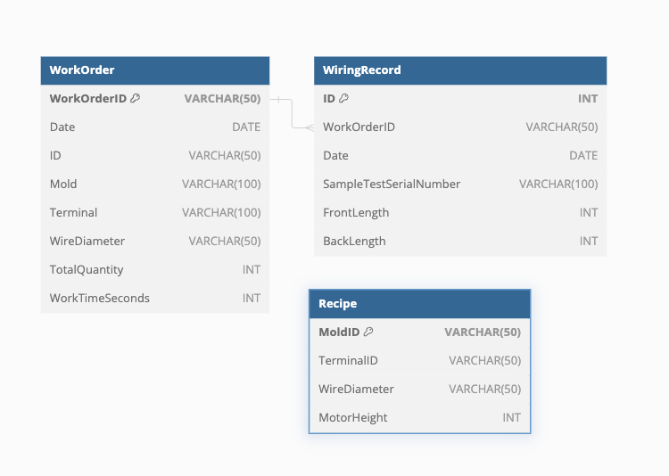

# 表單之間的關係
## 1. WorkOrder 表單保存每一筆工單的信息。
## 2. WiringRecord 表單記錄每一筆打線操作，並通過 WorkOrderID 與 WorkOrder 表單關聯，這樣可以查詢到該打線記錄所屬的工單。
## 3. Recipe 表單保存配方內容，以便在後續製作中可以快速調用所需的配置信息。


# 使用說明

## 新增工單

當有新的工單時，將其信息插入 WorkOrder 表單。例如：

```sql
INSERT INTO WorkOrder (WorkOrderID, Date, ID, Mold, Terminal, WireDiameter, TotalQuantity, WorkTimeSeconds)
VALUES ('WO12345', '2024-07-12', 'ID67890', 'MoldA', 'TerminalX', '1.5mm', 1000, 3600);
```

## 記錄打線操作

當進行打線操作時，將數據插入 WiringRecord 表單。例如：

```sql
INSERT INTO WiringRecord (WorkOrderID, Date, SampleTestSerialNumber, FrontLength, BackLength, WorkTimeSeconds)
VALUES ('WO12345', '2024-07-12', 'Test123', 100, 200, 120);
```

## 保存配方內容

當有新的配方需要保存時，將其信息插入 Recipe 表單。例如：

```sql
INSERT INTO Recipe (MoldID, TerminalID, WireDiameter, MotorHeight)
VALUES ('MoldA', 'TerminalX', '1.5mm', 50);
```


## 查詢工單及其相關的打線記錄

您可以通過工單編號來查詢工單及其所有相關的打線記錄。例如：

```sql
SELECT * FROM WorkOrder WHERE WorkOrderID = 'WO12345';
SELECT * FROM WiringRecord WHERE WorkOrderID = 'WO12345';
```
